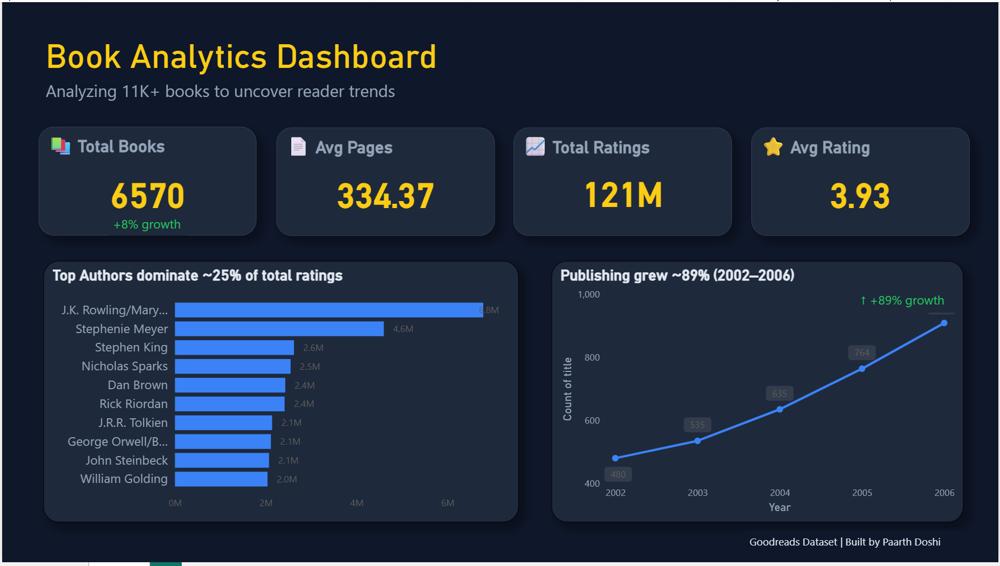

# Book-Analytics-Dashboard
Data visualization dashboard analyzing reader trends from a dataset of 11K+ books. Built with Power BI to explore publishing growth and author ratings.

## Project Overview
This project performs an in-depth analysis of a dataset containing 11,000+ books. The goal was to uncover meaningful patterns in reader behavior, publishing trends, and author performance.

## Key Insights
* **Publishing Growth**: Analyzed an ~89% growth in book publishing between 2002 and 2006.
* **Top Authors**: Identified that the top 10 authors dominate approximately 25% of the total ratings in the dataset.
* **Reader Trends**: Visualized relationships between total books, average page counts, and reader satisfaction.

## Visualization

## Technologies Used
* **Data Processing**: [e.g., Python/Pandas]
* **Visualization**: [e.g., Power BI/Tableau/Matplotlib]

## License
Distributed under the MIT License. See `LICENSE` for more information.
